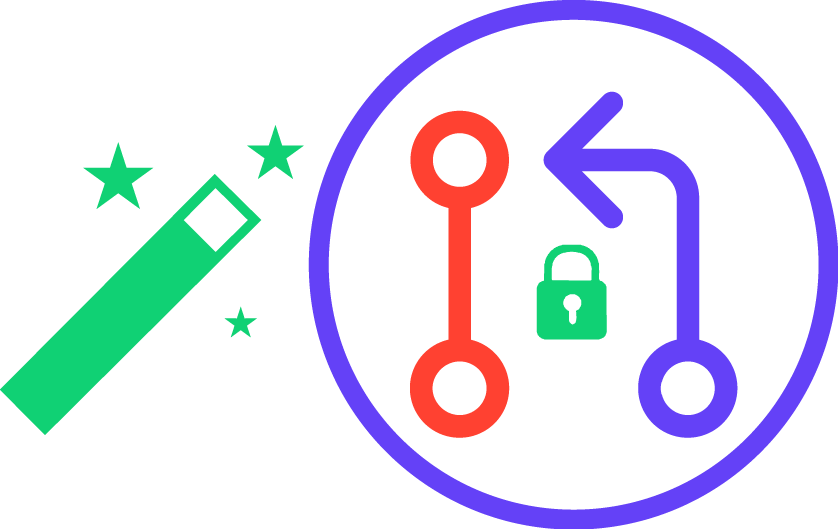

[](#)
[](https://codecov.io/gh/step-security/secure-workflows)
[](https://raw.githubusercontent.com/step-security/secure-workflows/main/LICENSE)

---

An open platform to update your CI/CD pipelines to comply with security requirements.

Secure-Workflows has been used to fix high-risk security issues in Top Critical Open Source projects, for which StepSecurity was rewarded a Secure Open Source (SOS) reward.

Secure-Workflows will be demoed at Linux Foundation's Open Source Summit [SupplyChainSecurityCon](http://sched.co/11Pvu).

<p align="left">
  
</p>

## What security issues does Secure-Workflows fix?

Secure-Workflows API takes in a GitHub Actions workflow file as an input and returns a transformed workflow YAML file with the following changes. You can select which of these changes you want to make.

### 1. Minimum `GITHUB_TOKEN` permissions are set for each job

#### Why is this needed?

The GITHUB_TOKEN is an automatically generated secret that lets you make authenticated calls to the GitHub API in your workflow runs. Actions generates a new token for each job and expires the token when a job completes. The token has write permissions to a number of API endpoints except in the case of pull requests from forks which are always read.

If the token is compromised due to a malicious Action or step in the workflow, it can be misused to overwrite releases or source code in a branch. To limit the damage that can be done in such a scenario, [GitHub recommends setting minimum token permissions for the GITHUB_TOKEN](https://github.blog/changelog/2021-04-20-github-actions-control-permissions-for-github_token/).

#### Before and After the fix

Before the fix, your workflow may look like this

```yaml
on:
  push:

jobs:
  closeissue:
    runs-on: ubuntu-latest

    steps:
      - name: Close Issue
        uses: peter-evans/close-issue@v1
        with:
          issue-number: 1
          comment: Auto-closing issue
```

After the fix, the workflow will have minimum permissions added for the GITHUB token.

```yaml
on:
  push:

permissions:
  contents: read

jobs:
  closeissue:
    permissions:
      issues: write # for peter-evans/close-issue to close issues
    runs-on: ubuntu-latest

    steps:
      - name: Close Issue
        uses: peter-evans/close-issue@v1
        with:
          issue-number: 1
          comment: Auto-closing issue
```

#### How does Secure-Workflows fix this issue?

Different GitHub Actions need different token permissions, so if you use multiple Actions in your workflow, you need to research the correct permissions needed for each Action. This can be time consuming and cumbersome.

Secure-Workflows stores the permissions needed by different GitHub Actions in a [knowledge base](<(https://github.com/step-security/secure-workflows/tree/main/knowledge-base/actions)>). When you try to set token permissions for your workflow, it looks up the permissions needed by each Action in your workflow and adds the permissions up to come up with a final recommendation.

If you are the owner of a GitHub Action, please [contribute to the knowledge base](https://github.com/step-security/secure-workflows/blob/main/knowledge-base/actions/README.md). This will increase trust for your GitHub Action and more developers would be comfortable using it, and it will improve security for everyone's GitHub Actions workflows.

### 2. Actions are pinned to a full length commit SHA

#### Why is this needed?

GitHub Action tags and Docker tags are mutatble. This poses a security risk. If the tag changes you will not have a chance to review the change before it gets used. GitHub's Security Hardening for GitHub Actions guide [recommends pinning actions to full length commit for third party actions](https://docs.github.com/en/actions/security-guides/security-hardening-for-github-actions#using-third-party-actions).

#### Before and After the fix

Before the fix, your workflow may look like this

```yaml
on:
  pull_request:

jobs:
  integration-test:
    runs-on: ubuntu-latest
    steps:
      - name: Checkout
        uses: actions/checkout@v1
      - name: Integration test
        uses: docker://ghcr.io/step-security/integration-test/int:latest
```

After the fix, each Action and docker image will be pinned to an immutable checksum.

```yaml
on:
  pull_request:

jobs:
  integration-test:
    runs-on: ubuntu-latest
    steps:
      - name: Checkout
        uses: actions/checkout@544eadc6bf3d226fd7a7a9f0dc5b5bf7ca0675b9
      - name: Integration test
        uses: docker://ghcr.io/step-security/integration-test/int@sha256:1efef3bbdd297d1b321b9b4559092d3131961913bc68b7c92b681b4783d563f0
```

#### How does Secure-Workflows fix this issue?

Secure-Workflows automates the process of getting the commit SHA for each mutable Action version or Docker image tag. It does this by using GitHub and Docker registry APIs.

### 3. Harden-Runner GitHub Action is added to each job

#### Why is this needed?

[Harden-Runner GitHub Action](https://github.com/step-security/harden-runner) installs a security agent on the Github-hosted runner to prevent exfiltration of credentials, monitor the build process, and detect compromised dependencies.

#### Before and After the fix

Before the fix, your workflow may look like this

```yaml
on:
  push:

jobs:
  closeissue:
    runs-on: ubuntu-latest

    steps:
      - name: Close Issue
        uses: peter-evans/close-issue@v1
        with:
          issue-number: 1
          comment: Auto-closing issue
```

After the fix, each workflow has the harden-runner Action added as the first step.

```yaml
on:
  push:

jobs:
  closeissue:
    runs-on: ubuntu-latest

    steps:
      - name: Harden Runner
        uses: step-security/harden-runner@v1
        with:
          egress-policy: audit # TODO: change to 'egress-policy: block' after couple of runs

      - name: Close Issue
        uses: peter-evans/close-issue@v1
        with:
          issue-number: 1
          comment: Auto-closing issue
```

#### How does Secure-Workflows fix this issue?

Secure-Workflows updates the YAML file and adds [Harden-Runner GitHub Action](https://github.com/step-security/harden-runner) as the first step to each job.

## Integration with OpenSSF Scorecard

Open Source Security Foundation (OpenSSF) Scorecards is an automated tool that assesses several important heuristics ("checks") associated with software security and assigns each check a score of 0-10.

Getting a higher scorecard score instills more confidence in those who plan to consume your software. It also eliminates several classes of software supply chain attacks. So, you should aim to get a high score.

However, fixing some of the checks that Scorecard reports is hard and time-consuming. Secure-Workflows make it easier to fix two of the hardest Scorecard issues (Token-Permissions and Pinned-Dependencies).

When you view the Scorecard results, you will notice a remediation tip that points to https://app.stepsecurity.io. This is a deep integration with SecureWorkflows.

<p align="left">
  
</p>

When you click the link, SecureWorkflows fetches the file to be fixed, fixes it, and shows the fixed file. You can then copy and paste the fixed file in your codebase.
